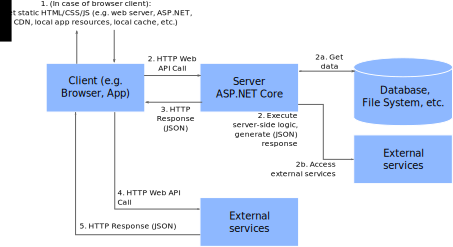

# ASP.NET Core

Web App and Web API Development with ASP.NET Core


<!-- .slide: class="left" -->
## Introduction

* Develop server-side logic for web apps
  * Serve static content
  * Dynamic content (e.g. HTML, CSS) creation on the server (*ASP.NET MVC*)
  * *HTTP Web APIs* called by other servers or *single page apps* (SPAs)
* Complete, *a la carte* framework
  * Covers all important aspects of web development
  * Can be reduced to specific needs
  * Can be extended with external libraries (NuGet)
* Open source, driven by Microsoft
* **Repeat fundamentals of [HTTP](https://en.wikipedia.org/wiki/Hypertext_Transfer_Protocol) if necessary**


<!-- .slide: class="left" -->
## Server-side rendering


<!-- .slide: class="left" -->
## Server-side rendering

* Client is a browser
  * Explicitly started by user
  * Embedded browser (e.g. [CEFSharp](https://github.com/cefsharp/CefSharp), [WebView](https://developer.chrome.com/multidevice/webview/gettingstarted))
* Most of the business logic runs on the server
  * Minor parts of the logic runs on the client<br/>
    (e.g. form validation in JavaScript)
  * Server accesses databases and external services
* Server generates HTML, CSS, JavaScript


<!-- .slide: class="left" -->
## Web APIs + Single Page Apps (SPA)




<!-- .slide: class="left" -->
## Web APIs + Single Page Apps (SPA)

* Client can be a browser
  * Anything that can speak HTTP, JSON, etc.<br/>
    (e.g. mobile app, CLI, server, desktop app, IoT device)
* Static HTML/CSS/JS for SPA
* Logic
  * HTTP Web API requests for running server-side business logic
  * View logic (e.g. manipulating DOM) runs on client
  * [JSON](https://rstropek.github.io/htl-mobile-computing/#/3/7) for transmitting data


<!-- .slide: class="left" -->
## ASP.NET Core Fundamentals

* ASP.NET Core app is a *console app*
* Embedded web server (*Kestrel*)
  * Comes via NuGet
  * No external web server (e.g. *Tomcat*, *IIS*) necessary
  * *Reverse Proxy* recommended for production use
* Create empty ASP.NET Core app with `dotnet new web`


<!-- .slide: class="left" -->
## Project File: *.csproj*

```
<!--#include file="aspnet-core/0010-basics/0010-basics.csproj" -->
```

* `wwwroot`: Folder for static content (e.g. HTML)
* `Microsoft.AspNetCore.All`: *Metapackage* for complete ASP.NET Core


<!-- .slide: class="left" -->
## Main Program: *Program.cs*

```
<!--#include file="aspnet-core/0010-basics/Program.cs" -->
```


<!-- .slide: class="left" -->
## Web App Pipeline: *Startup.cs*

```
<!--#include file="aspnet-core/0010-basics/Startup.cs" -->
```


<!-- .slide: class="left" -->
## Web App Pipeline: *Startup.cs*


* Image Source [Microsoft docs](https://docs.microsoft.com/en-us/aspnet/core/fundamentals/middleware?tabs=aspnetcore2x)


<!-- .slide: class="left" -->
## Web App Pipeline: *Startup.cs*

* Create list of *Middlewares* (=*Pipeline*) using functions `Use`, `Map` and `Run`
  * `Use`: Perform some logic and optionally call `next` to invoke next middleware
  * `Map`: Build sub-middleware for specific URL prefix
  * `Run`: Last element in pipeline, no `next`
* **Everything is asynchronous**
* [Read more about *ASP.NET Core Startup*...](https://docs.microsoft.com/en-us/aspnet/core/fundamentals/startup)


<!-- .slide: class="left" -->
## Middlewares: Static Files

```
<!--#include file="aspnet-core/0020-static-files/Startup.cs" -->
```


<!-- .slide: class="left" -->
## Middlewares: Static Files

* Add ready-made middlewares using `Use...` functions
* For static files: `UseStaticFiles()`
* [Read more about static files middleware...](https://docs.microsoft.com/en-us/aspnet/core/fundamentals/static-files)


<!-- .slide: class="left" -->
## Middlewares: Web API

```
<!--#include file="aspnet-core/0030-web-api/app/Startup.cs" -->
```


<!-- .slide: class="left" -->
## Middlewares: Web API

```
<!--#include file="aspnet-core/0030-web-api/app/ToDoController.cs" -->
```

* Get all todo items with<br/>
  `GET http://localhost:<port>/api/todo-items`


<!-- .slide: class="left" -->
## Middlewares: Web API

```
<!--#include file="aspnet-core/0030-web-api/app/ToDoControllerIndex.cs" -->
```

* Get todo item at index 1 with<br/>
  `GET http://localhost:<port>/api/todo-items/1`


<!-- .slide: class="left" -->
## Middlewares: Web API

```
<!--#include file="aspnet-core/0030-web-api/app/ToDoControllerAdd.cs" -->
```

* Add todo item with HTTP `POST` request


<!-- .slide: class="left" -->
## Middlewares: Web API

```
<!--#include file="aspnet-core/0030-web-api/app/ToDoControllerUpdate.cs" -->
```

* Update todo item with HTTP `PUT` request


<!-- .slide: class="left" -->
## Middlewares: Web API

```
<!--#include file="aspnet-core/0030-web-api/app/ToDoControllerDelete.cs" -->
```

* Delete todo item with HTTP `DELETE` request


<!-- .slide: class="left" -->
## Testing Web APIs: Project File

```
<!--#include file="aspnet-core/0030-web-api/test/test.csproj" -->
```


<!-- .slide: class="left" -->
## Testing Web APIs: Test Web Server

```
<!--#include file="aspnet-core/0030-web-api/test/TestToDoController.cs" -->
```


<!-- .slide: class="left" -->
## Testing Web APIs

```
<!--#include file="aspnet-core/0030-web-api/test/TestToDoControllerGetAll.cs" -->
```


<!-- .slide: class="left" -->
## Testing Web APIs

```
<!--#include file="aspnet-core/0030-web-api/test/TestToDoControllerIndex.cs" -->
```


<!-- .slide: class="left" -->
## Testing Web APIs

```
<!--#include file="aspnet-core/0030-web-api/test/TestToDoControllerAdd.cs" -->
```


<!-- .slide: class="left" -->
## Testing Web APIs

```
<!--#include file="aspnet-core/0030-web-api/test/TestToDoControllerDelete.cs" -->
```


<!-- .slide: class="left" -->
## Testing Web APIs

```
<!--#include file="aspnet-core/0030-web-api/test/TestToDoControllerUpdate.cs" -->
```
