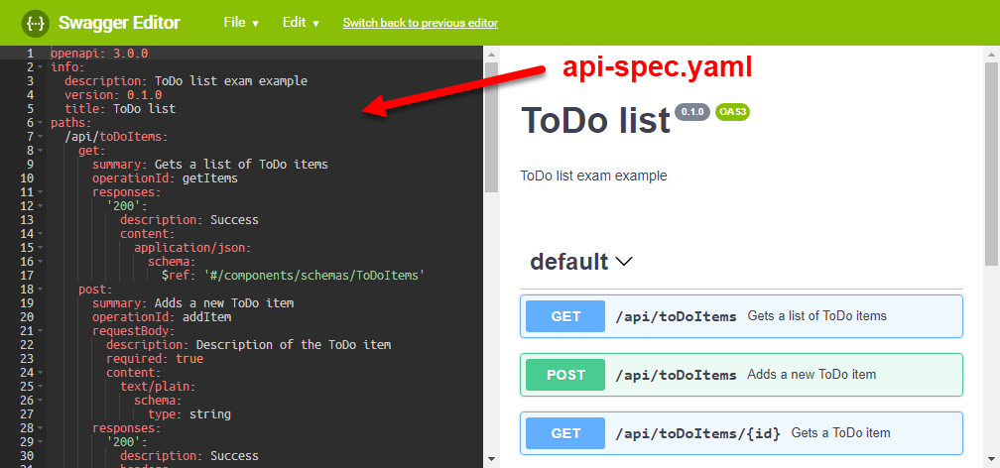

# Aufgabe 1

* Anzahl Punkte: 18
* Kalkulierte Zeit: 45 Minuten

## Einleitung

Ihre Aufgabe ist die Implementierung einer Web API **mit *ASP.NET Core***, die einfache, mathematische Formeln ausrechnen kann. Die Web API soll Ausdrücke wie *1+2+3* (Ergebnis wäre *6*) auswerten können. Zusatzpunkte gibt es, wenn die Web API auch Variablen unterstützt (Details siehe unten).

Die technische Spezifikation der Web API finden Sie im *Open API* Format in [*api-spec.yaml*](api-spec.yaml). Hinweis: Sie können die Spezifikation in einem angenehm lesbaren Format ansehen, indem Sie [https://editor.swagger.io/](https://editor.swagger.io/) im Browser öffnen und den Inhalt der Datei [*api-spec.yaml*](api-spec.yaml) in den Eingabebereich auf der linken Seite kopieren:



**Lesen Sie die API Spezifikation genau!** Auch scheinbare Kleinigkeiten wie zum Beispiel geforderte *Response Codes* (z.B. *400* für *Bad Request*) sind wichtig und müssen beachtet werden.

## Anforderungen

Beachten Sie beim Lösen der Aufgabe folgende Anforderungen.

### Pflichtaufgaben (9 Punkte)

Pflichtaufgaben, die alle korrekt gelöst werden müssen, um Punkte für das Beispiel zu erhalten:

* Funktionsfähige, spezifikationsgemäße Umsetzung der Operation *evaluate* (`POST /api/evaluate...`) **ohne** Variablen.
  * Sie können davon ausgehen, dass Formeln nur aus **positiven, ganzen Zahlen** und dem **Plus-Operator** (*+*) bestehen (z.B. *1*, *1+2*, *1+2+3*).
  * Besondere Prüfung oder Fehlerbehandlung bei ungültigen Formeln ist **nicht** notwendig.
  * Testfälle mit Beispielformeln finden Sie unten.
* Korrekte Logik für Berechnung des Formelergebnis
* Mindestens ein **Unit Test**, der einen Aspekt der Rechenlogik automatisiert auf Korrektheit überprüft

### Optionale Aufgaben

Optionale Aufgaben, um die volle Punktzahl für das Beispiel zu erhalten:

* 2,5 Punkte: Funktionsfähige, spezifikationsgemäße Umsetzung der Operationen *getVariables* (`GET /api/variables`) und *setVariable* (`POST /api/variables`) zum Verwalten von Variablenwerten
* 2,5 Punkte: Rechenlogik inklusive Variablen (z.B. *x*, *1+x*, *x+1+y*)
* 1 Punkt: Rechenlogik ausgegliedert in eine **eigene *.NET Standard* Class Library**
* 2 Punkte: Injizieren der Rechenlogik über [*ASP.NET Core Dependency Injection*](https://docs.microsoft.com/en-us/aspnet/core/fundamentals/dependency-injection#registering-your-own-services)
* 1 Punkt: Guter Programmierstil (z.B. *readme.md*, *.gitignore*, keine unnötigen Dateien eingecheckt, etc.) und effizienter Algorithmus


## Testfälle

### *evaluate* ohne Variablen

Request:

```
POST /api/evaluate
Content-Type: application/json

{ "expression": "1+2+3" }
```

Response:

```
{ "expression": "1+2+3", "result": 6 }
```

### Setzen einer Variable

Request:

```
POST /api/variables
Content-Type: application/json

{ "name": "x", "value": 4 }
```

Response:

```
{ "name": "x", "value": 4 }
```

### *evaluate* mit Variable

Annahme: Variable *x* hat den Wert *4*.

Request:

```
POST /api/evaluate
Content-Type: application/json

{ "expression": "1+2+x+3" }
```

Response:

```
{ "expression": "1+2+x+3", "result": 10 }
```
