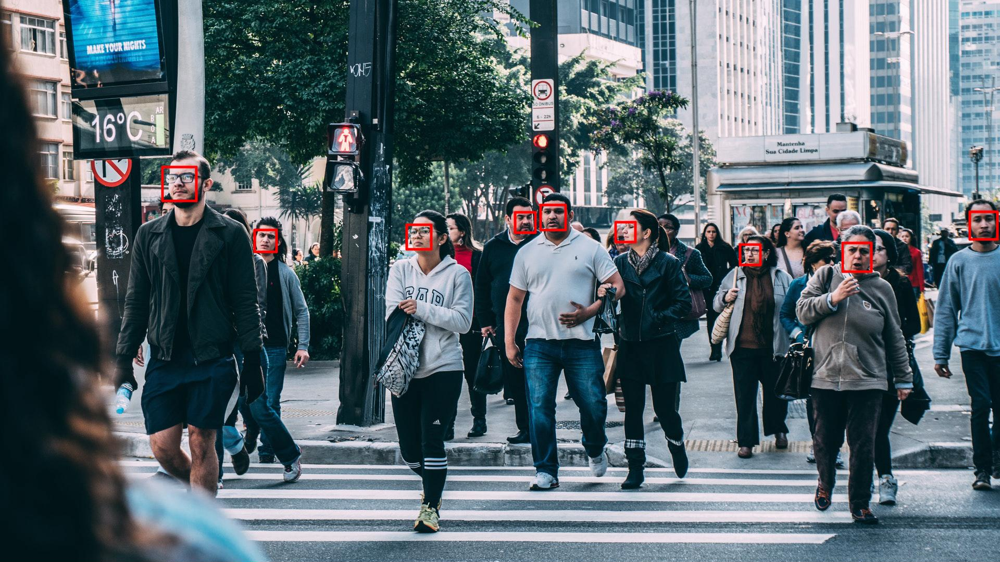

# "Face Detection" Exercise

## Introduction

Your job is to write a command line tool that can detect faces in photos and mark them with a red rectangle. You should use a machine learning (aka *Artificial Intelligence* aka *Deep Learning*) approach to solve this problem.

Of course, developing your own machine learning solution for face detection would take far too much time. Therefore, you should use Microsoft's [Cognitive Services](https://azure.microsoft.com/en-us/services/cognitive-services/). They offer various Web APIs with which you can interact with powerful machine learning systems for vision, speech, search, etc.

## Specification

* Write a platform-independent command line tool using C# and .NET Core.

* The tool expects two parameters in the command line (example: `FaceRecognition c:\temp\input.jpg c:\temp\output.jpg`):
  * source image's file name
  * output image's file name

* In case of missing or invalid arguments, the tool has to print a corresponding error message to *stderr*.

* The tool has to...
  * ...read the source file from disk, 
  * ...detect faces, 
  * draw a red rectangle around each face, and 
  * save the resulting image into the output file.

## Test Data

Here is an example of a source image:


Here you see the image after face detection:



## Hints

* **Before you start coding**, take some time to make yourself familiar with the services that [Microsoft Cognitive Services](https://azure.microsoft.com/en-us/services/cognitive-services/) offer. You can use the offering's website to interactively try the different machine learning services.

* Next, create a **free** trial API key for [Microsoft Cognitive Services](https://azure.microsoft.com/en-us/services/cognitive-services/). It is free. The number of requests you can make is limited but sufficient for this exercise.

* For platform-independent image manipulation, you can use the NuGet package `SixLabors.ImageSharp.Drawing`.

* For handling JSON, you can use the NuGet package `Newtonsoft.Json`.

* Use .NET's `FileStream.ReadAsync` method to read a binary image file into a byte array (`byte[]`).

* Use .NET's `HttpClient.PostAsync` method to send your source image to *Cognitive Services* for face detection.

* Take a look at the [Web API Reference Documentation](https://docs.microsoft.com/en-us/azure/cognitive-services/face/apireference) for the face detection API. If necessary, use a search engine to find a C# sample for face detection in Microsoft's documentation.

* Here is an example for how to draw a red rectangle with *ImageSharp*:

```
var image = Image.Load<Rgba32>(imageBytes);
var pen = new Pen<Rgba32>(Rgba32.Red, 5);

image.Mutate(ctx =>
{
    ctx.DrawPolygon(pen, new[]
    {
        new PointF(100, 100), new PointF(300, 100),
        new PointF(300, 300), new PointF(100, 300),
        new PointF(100, 100)
    });
});

image.SaveAsJpeg(targetFileName);
```

## Advanced Exercises

* If you have finished the exercise early, try to get additional data from the face detection API (e.g. estimated age) and add it as text to the target image.

## Solution

You can find a sample solution (deliberately without comments) in [*Program.cs*](Program.cs) and [*FaceRecognition.csproj*](FaceRecognition.csproj). However, before you take a look at it, try to find your own solution!
