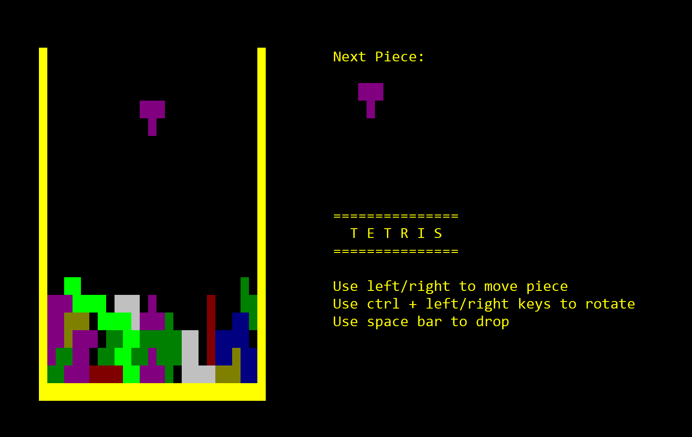

# C# Recap

Let's remember C# fundamentals


<!-- .slide: class="left" -->
## Learn by Example



[Sample Code](https://github.com/rstropek/htl-csharp/tree/master/csharp-recap/0010-tetris)


<!-- .slide: class="left" -->
## Learn by Example (cont.)

* Learn about C# without too much theory
  * C# language features
  * Design patterns
  * Writing tests
* Learn about Visual Studio in a practical example
  * Code navigation
  * Building
  * Debugging
  * Unit testing


<!-- .slide: class="left" -->
## Create .NET Console App

* Create Console App in Visual Studio
* Create Console App in command line
  * Windows
  * Linux


<!-- .slide: class="left" -->
## Draw Tetris Border and Usage

[*Program.cs*](https://github.com/rstropek/htl-csharp/blob/master/csharp-recap/0010-tetris/tetris/Program.cs)

* [Constants](https://docs.microsoft.com/en-us/dotnet/csharp/language-reference/keywords/const)
* Working with [`Console`](https://docs.microsoft.com/en-us/dotnet/api/system.console?view=netcore-2.0)
* Functional programming with delegates


<!-- .slide: class="left" -->
## Constants

```
public const int BOARD_WIDTH = 25;
public const int BOARD_HEIGHT = 20;
```

* What does `const` mean?
* Which data types can be `const`?
* [Learn more](https://docs.microsoft.com/en-us/dotnet/csharp/language-reference/keywords/const)


<!-- .slide: class="left" -->
## Console

```
Console.Clear();
Console.CursorVisible = false;
...
if (Console.KeyAvailable)
{
  var pressedKey = Console.ReadKey();
  if ((pressedKey.Modifiers & ConsoleModifiers.Control) != 0)...
}
...
var oldTop = Console.CursorTop;
Console.SetCursorPosition(BORDER_LEFT, BORDER_TOP);
Console.BackgroundColor = BORDER_COLOR;
Console.Write("GAME OVER");
...
```


<!-- .slide: class="left" -->
## Functional Programming Basics

```
private static void RestoreOriginalState(Action drawingFunc)
{
  // Do some preparation

  drawingFunc();

  // Do some cleanup
}
...
RestoreOriginalState(() =>
{
  Console.SetCursorPosition(BORDER_LEFT, BORDER_TOP);
  Console.BackgroundColor = BORDER_COLOR;
  Console.Write(' ');
});
```

* What does 'Action' mean?
* Discuss 'Func', too.


<!-- .slide: class="left" -->
# Tetris Piece

[*Piece.cs*](https://github.com/rstropek/htl-csharp/blob/master/csharp-recap/0010-tetris/tetris/Piece.cs)

* [C# XML documentation](https://docs.microsoft.com/en-us/dotnet/csharp/programming-guide/xmldoc/xml-documentation-comments)
* Immutable classes
* Classes vs. structures (aka reference vs. value types)
  * See also [*Memory Consumption Example*](https://github.com/rstropek/htl-csharp/tree/master/csharp-recap/0020-memory)
* Disassembling (e.g. [*dnSpy*](https://github.com/0xd4d/dnSpy))


<!-- .slide: class="left" -->
## C# XML Code Documentation

```
/// <summary>
/// Represents a single piece in a tetris game
/// </summary>
public class Piece
{
  /// <summary>
  /// Initializes a new instance of the <see cref="Piece"/> class
  /// </summary>
  /// <param name="color">Color of the piece</param>
  /// <param name="pattern">Pattern of the piece (see remarks for details)</param>
  /// <remarks>
  /// An array element set to <c>true</c> in parameter <paramref name="pattern"/> represents
  /// a colored pixel. <c>false</c> represents an empty pixel.
  /// </remarks>
  public Piece(ConsoleColor color, bool[,] pattern) ...
}
```


<!-- .slide: class="left" -->
## [Tetris Pieces](https://en.wikipedia.org/wiki/Tetris#Colors_of_Tetromino)

[*Pieces.cs*](https://github.com/rstropek/htl-csharp/blob/master/csharp-recap/0010-tetris/tetris/Pieces.cs)

* [Static classes](https://docs.microsoft.com/en-us/dotnet/csharp/programming-guide/classes-and-structs/static-classes-and-static-class-members)
* [Multidimensional arrays](https://docs.microsoft.com/en-us/dotnet/csharp/programming-guide/arrays/multidimensional-arrays) and [collection initialization](https://docs.microsoft.com/en-us/dotnet/csharp/programming-guide/classes-and-structs/object-and-collection-initializers#collection-initializers)
* [`readonly`](https://docs.microsoft.com/en-us/dotnet/csharp/language-reference/keywords/readonly)


<!-- .slide: class="left" -->
## Static Classes

```
public static class Pieces
{
  ...
}
```

* What is a `static class`?


<!-- .slide: class="left" -->
## Multidimensional Arrays, `readonly`

```
private static readonly bool[,] I = { { true, true, true, true } };
private static readonly bool[,] J = { { true, true, true }, { false, false, true } };
```

* What is the difference between *multidimensional array* and *jagged arrays*?
* What does `readonly` mean?
* Which data types can be `const` and which can be `readonly`?


<!-- .slide: class="left" -->
## Board Content

[*BoardContent.cs*](https://github.com/rstropek/htl-csharp/blob/master/csharp-recap/0010-tetris/tetris/BoardContent.cs)

* [Arrays](https://docs.microsoft.com/en-us/dotnet/csharp/programming-guide/arrays/#array-overview)
* [Indexer](https://docs.microsoft.com/en-us/dotnet/csharp/programming-guide/indexers/)
* [Expression-bodied members](https://docs.microsoft.com/en-us/dotnet/csharp/programming-guide/statements-expressions-operators/expression-bodied-members)


<!-- .slide: class="left" -->
## Indexer and Expression-bodied Members

```
private readonly bool[,] content;
...
public bool this[int row, int col]
{
  set => content[row, col] = value;
  get => content[row, col];
}
```


<!-- .slide: class="left" -->
## Board

[*Board.cs*](https://github.com/rstropek/htl-csharp/blob/master/csharp-recap/0010-tetris/tetris/Board.cs)
[*BoardException*](https://github.com/rstropek/htl-csharp/blob/master/csharp-recap/0010-tetris/tetris/BoardException.cs)

* [Auto-implemented properties](https://docs.microsoft.com/en-us/dotnet/csharp/programming-guide/classes-and-structs/auto-implemented-properties)
* [Optional arguments](https://docs.microsoft.com/en-us/dotnet/csharp/programming-guide/classes-and-structs/named-and-optional-arguments#optional-arguments)
* Performance discussions
* [Custom exceptions](https://docs.microsoft.com/en-us/dotnet/standard/exceptions/how-to-create-user-defined-exceptions) and [`Try...` pattern](https://docs.microsoft.com/en-us/dotnet/standard/design-guidelines/exceptions-and-performance#try-parse-pattern)
* Enumerations
* [Delegates](https://docs.microsoft.com/en-us/dotnet/csharp/programming-guide/delegates/)
  * See also [*Linq* exercise](https://github.com/rstropek/htl-csharp/tree/master/csharp-recap/0030-linq)


<!-- .slide: class="left" -->
## Auto-implemented Properties

```
public int CurrentRow { get; private set; } = 0;
public int CurrentCol { get; private set; } = 0;
public Piece CurrentPiece { get; private set; } = null;
```


<!-- .slide: class="left" -->
## Optional Arguments

```
public Board(IBoardContent content, RandomPieceGenerator pieceGenerator = null)
{
  ...
}
```


<!-- .slide: class="left" -->
## Custom  Exceptions

```
public class BoardException : Exception
{
  public BoardException() { }

  public BoardException(string message) : base(message) { }

  public BoardException(string message, Exception innerException) : base(message, innerException) { }
}
```


<!-- .slide: class="left" -->
## *Try...* Pattern

```
public bool TryMergingPatternIntoBoardContent(int targetRow, int targetCol, bool[,] pattern)
{
  if (/* Check */) {
      return false; // Indicate error
  }

  // Do something

  return true; // Indicate success
}

public void MergePatternIntoBoardContent(int targetRow, int targetCol, bool[,] pattern)
{
  if (!TryMergingPatternIntoBoardContent(targetRow, targetCol, pattern)) {
    throw new BoardException();
  }
}
```


<!-- .slide: class="left" -->
## Enumerations

```
public enum Direction : int
{
  Down = 0,
  Left = -1,
  Right = 1
}
```


<!-- .slide: class="left" -->
## Delegates

```
public delegate Piece RandomPieceGenerator();
...
public static readonly RandomPieceGenerator SinglePixelGenerator = 
  () => new Piece(ConsoleColor.White, PiecesMockup.SinglePixel);
```


<!-- .slide: class="left" -->
## Board Content Iterator

[*BoardContentIteratorExtension.cs*](https://github.com/rstropek/htl-csharp/blob/master/csharp-recap/0010-tetris/tetris/BoardContentIteratorExtension.cs)

* [Generic types](https://docs.microsoft.com/en-us/dotnet/csharp/programming-guide/generics/)
* [Enumerables](https://docs.microsoft.com/en-us/dotnet/api/system.collections.generic.ienumerable-1?view=netcore-2.0#Remarks)
* Linq basics
* [Extension methods](https://docs.microsoft.com/en-us/dotnet/csharp/programming-guide/classes-and-structs/extension-methods)
* [Tuples](https://docs.microsoft.com/en-us/dotnet/csharp/tuples)


<!-- .slide: class="left" -->
## Unit Testing

[*Tetris.Tests*](https://github.com/rstropek/htl-csharp/tree/development/csharp-recap/0010-tetris/Tetris.Tests)

* Visual Studio unit testing
* [Mock objects](https://en.wikipedia.org/wiki/Mock_object)
