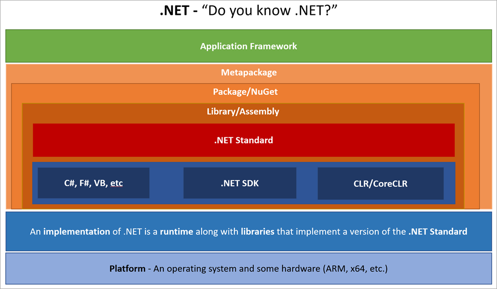

# .NET Recap

Let's remember .NET fundamentals

<!-- .slide: class="left" -->
## .NET Framework

* Development platform for building apps for web, Windows, Windows Server, and Microsoft Azure
* Components
  * Common language runtime (CLR)
  * .NET Framework class library
* .NET Framework services include:
  * Memory management
  * Type and memory safety
  * Security
  * Networking
  * Application deployment
* Data structures and APIs that abstract the lower-level Windows operating system
* Supports many programming languages including C#, F#, and Visual Basic

<!-- .slide: class="left" -->
## [.NET Core](https://www.microsoft.com/net/core#windowscmd)

* Cross-platform and open source implementation of .NET
* Future of .NET
* Important components
  * [Core Common Language Runtime (CoreCLR)](https://github.com/dotnet/coreclr)
  * [Core Base Class Library (CoreFX)](https://github.com/dotnet/corefx)
  * [.NET Core SDK](https://docs.microsoft.com/en-us/dotnet/core/sdk)
* [.NET Standard](https://docs.microsoft.com/en-us/dotnet/standard/net-standard)
  * A formal specification of .NET APIs that are available in each .NET implementation

> We will focus on .NET Core and .NET Standard in the C# course

<!-- .slide: class="left" -->
## [Xamarin](https://docs.microsoft.com/en-us/xamarin/cross-platform/get-started/introduction-to-mobile-development)

* Use C# to write mobile apps for Android and iOS
* Cross-platform mobile development (*Xamarin.Android* and *Xamarin.iOS*)
  * Code reuse
  * Reduces effort for building an app for multiple platforms
  * Bindings and interop to underlying SDKs and native languages (e.g. Java, Objective-C)
* Compiled to *native code*, not interpreted
  * [Good performance](https://docs.microsoft.com/en-us/xamarin/cross-platform/deploy-test/memory-perf-best-practices)

> We will focus on Xamarin and Xamarin Forms in the Mobile Computing course

<!-- .slide: class="left" -->
## .NET Core Architecture

<!-- .slide: class="left" -->
## Further Readings and Exercises

* Want to know more? Read/watch...
  * [.NET Framework Guide](https://docs.microsoft.com/en-us/dotnet/framework/index)
  * [Create your first .NET Core app](https://www.microsoft.com/net/core#windowscmd)
  * [C# Fundamentals](https://www.microsoft.com/net/tutorials/csharp/getting-started)
  * [Writing C# Code in Visual Studio](https://docs.microsoft.com/en-us/visualstudio/ide/writing-code-in-the-code-and-text-editor)
  * [.NET Core Slides (Stropek)](https://github.com/rstropek/Samples/blob/master/AspNetCoreWorkshop/Slides/BASTA%202017%20-%20CSharp%20Workshop%20-%20Rainer%20Stropek.pdf)
