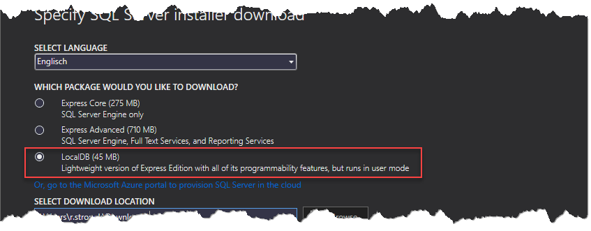

# How to Install *LocalDB*

## Download and Install *LocalDB*

* Open [https://www.microsoft.com/en-US/download/details.aspx?id=55994](https://www.microsoft.com/en-US/download/details.aspx?id=55994)

* Download and start installer

* Select *Download Media*


* Download *LocalDB* (approx. 45MB)



* Open download folder

* Run *LocalDB* setup (*SqlLocalDB.msi*)

* After running the setup, you can open connections to *LocalDB* from C# with the following connection string: `Server=(localdb)\\MSSQLLocalDB;Database=Customers`

```
public class CustomerContext : DbContext
{
    ...

    protected override void OnConfiguring(DbContextOptionsBuilder optionsBuilder)
    {
        optionsBuilder.UseSqlServer("Server=(localdb)\\MSSQLLocalDB;Database=Customers");
    }
}
```

## Download *SQL Operations Studio*

You can access *LocalDB* from any SQL Server tool including *Visual Studio Server Exporer*. I recommend the free and cross-platform tool [*SQL Operations Studio*](https://docs.microsoft.com/en-us/sql/sql-operations-studio/download).
