# Car Database Exercise

## Introduction

Your job is to prepare a test database with car data.

## Data Model

* Car makes (e.g. Toyota, BMW, VW, Tesla)
* Car models (e.g. Prius, Golf, Model S)
  * Every car model is assigned to a car make
* People who own cars
* Ownerships: Who owns which car?
  * Many-to-many relationship between *Person* and *CarModel*

## Test Data

Generate test data using the test data generation service [mockaroo](https://www.mockaroo.com/) (or something similar).

## Requirements

* Write program that generates a SQLite database file with the data model specified above.

* Use *Entity Framework Core*.

* Fill the SQListe database file with demo data (*mockaroo*)...
  * ...20 car makes,
  * ...100 car models,
  * ...5000 people,
  * ...one ownership per person. Each person should be assigned a random car model with a random vehicle identification number.

* After filling the database, your application has to print the following statistics about the generated database:
  * How many car ownerships have been created per car make
  * Which car models do not have any assigned ownerships

## Extra Points

You can earn an extra point if you:

* Check in your source code
* Check in the generated SQLite database file
* Notify Mr. Stropek via GitHub issue
