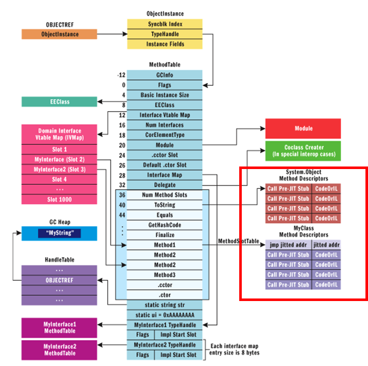

# Profiling

Optimizing C# Applications

<!-- .slide: class="left" -->
## Why Optimizing?

* Customer satisfaction
  * Customers report performance problems
  * Reduce churn rate
  * Tip: Ask your users if they are leaving because of poor performance
* Raise conversion rate
  * Consider the first impression potential users have from your software
  * Tip: Ask your users why they are not buying
* Reduce TCO of your application
  * Performance problems waste your user's time = money
  * Reduce TCO for your customers by lowering system requirements
  * Cloud environment is too expensive

<!-- .slide: class="left" -->
## Optimization Anti-Patterns

* Add optimizations during initial development
  * Aka *premature optimization*
  * Write obvious (not naive) code first -> measure -> optimize if necessary
  * Perf problems will always be where you don't expect them
* Optimize code without measuring
  * Without measuring, optimized code is often slower
  * Make sure to know if your optimization brought you closer to your goals
* Optimize for non-representative environments
  * Specify problematic environments as accurate as possible
  * Test your application on systems similar to your customers' environments
  * Hardware, software, test data (consider data security)

<!-- .slide: class="left" -->
## Optimization Anti-Patterns

* Optimization projects without concrete goals
  * Add perf goals (quantifiable) in requirements
  * You could spend endless time optimizing your applications
  * Optimize to solve concrete problems (e.g. for memory, for throughput, for response time)
* Soft problems or goals
  * Strive for quantifiable perf metrics in problem statements and goals
  * Objective perf problems instead of subjective stories
* Optimize without a performance baseline
  * Always know your performance baseline and compare against it
  * Reproducible test scenarios are important

<!-- .slide: class="left" -->
## Optimization Anti-Patterns

* Optimize without profound knowledge about your platform
  * Know your runtime, platform, hardware, and tools
* Optimize the wrong places
  * E.g. optimize C# code when you have a DB-related problem
  * Spend enough time on root-cause analysis for your perf problems
* Ship debug builds
  * Release builds are much faster than debug builds

<!-- .slide: class="left" -->
## Optimization Anti-Patterns

* Optimize everything
  * Focus on performance-critical aspects of your application instead
  * Pareto principle (80/20)
* Architect without performance in mind
  * Avoid architecture with inherent performance problems
  * If necessary, consider prototyping in early project stages
* Confuse performance and user experience
  * Async programming might not be faster but delivers better user experience
* Ignore Telemetry
  * Real-world performance data (especially in SaaS-scenarios)

<!-- .slide: class="left" -->
## Good Optimization Projects

1. Plan for it
   * Put it on your backlog
   * Get (time) budget for it (time-boxing); consider business case for your optimization project
   * Follow Design-to-Cost approach
   * Make yourself familiar with corresponding tools
2. Prepare a defined, reproducible test scenario
   * Hardware, software, network
   * Test data (e.g. database)
   * Application scenarios (automate if possible)
3. Measure performance baseline
   * E.g. CPU%, memory footprint, throughput, response time

<!-- .slide: class="left" -->
## Good Optimization Projects

4. Define performance goals
   * Must be measurable
   * Involve stakeholders (e.g. product owners, customers, partners, etc.)
5. Optimize - Measure - Analyze Cycle
   * Don't change too many things at the same time
   * Measure after optimizing
   * Compare against baseline; if necessary, reset your baseline
   * Check if you have reached performance goals/time-box
6. Ask for feedback in real-world environments
   * E.g. friendly customers, testing team
   * Telemetry (e.g. Application Insights)

<!-- .slide: class="left" -->
## Good Optimization Projects

7. Document and present your work
   * Architecture, code, measurement results
   * Potentially change your system requirements, guidelines for admins, etc.
   * Share best/worst practices with your peers
8. Ship your results
   * Remember: Ship release builds
   * Continuous deployment/short release cycles let customers benefit from perf optimizations
   * Consider hotfixes

<!-- .slide: class="left" -->
## Use the Cloud

* Easy to build different execution environments
  * Number of processors, RAM, different operating systems, etc.
  * Performance of database clusters
  * Don't wait for admins to setup/deliver test machines/VMs
* Design for scale-out and micro-services
  * Easier to add/remove VMs/containers than scaling up/down
  * Use micro-services and use e.g. Azure Websites or Docker to map to server farms
* Extremely cost efficient
  * You only pay for the time your perf tests last
  * You can use your partner benefits, BizSpark benefits, etc.

<!-- .slide: class="left" -->
## Use the Cloud

* Less data security issues if you use artificial test data
* Ability to run large-scale load tests
  * Gather perf data during long-running, large-scale load tests
* [SaaS](https://en.wikipedia.org/wiki/Software_as_a_service) enables you to optimize for a concrete environment
  * [Economy of scale](https://en.wikipedia.org/wiki/Economies_of_scale)

<!-- .slide: class="left" -->
## Performance influencers

* Performance of storage system
  * Database, file system, etc.
* Performance of services used
  * E.g. external web services
* Network characteristics
  * How chatty is your application?
  * Latency, throughput, bandwidth
  * Especially important in multi-tier applications

<!-- .slide: class="left" -->
## Performance influencers

* Efficiency of your algorithms
  * Core algorithms
  * Parallel vs. sequential
* Platform characteristics
  * JIT compiler
  * Garbage collector
* Hardware
  * Number of cores, 64 vs. 32 bits, RAM, SSDs, etc.

<!-- .slide: class="left" -->
## Database

* Network connection to the database
  * Latency, throughput
  * Do you really need all the data you read from the database (e.g. unnecessary columns)?
* Generation of execution plan
  * Statement parsing, compilation of execution plan
  * Bound to CPU-power of database server
  * Can't you simplify your query to speed up parse and compile time?
* Query execution
  * Complexity of query, index optimization, etc.
  * You might need a database expert/admin to tune your SQL statements

<!-- .slide: class="left" -->
## Database

* Process DB results
  * Turn DB results into .NET objects (O/R mappers)
* DB access characteristics
  * Many small vs. few large statements
  * Lazy loading
  * DB latency influences DB access strategy

<!-- .slide: class="left" -->
## Network

* How often do you call over the network?
  * Latency, speed-of-light problem
  * Ratio between latency and service operation
  * Consider reducing network calls with caching (e.g. [Redis](https://redis.io/) cache)... 
    ...but make sure that you cache doesn't make perf worse!
* How much data do you transfer?
  * Transfer less data (e.g. unnecessary database columns)
  * Make protocol more efficient (e.g. specific REST services or OData instead of generic services)
* Measuring is important
  * The tools you use might do things you are not aware of (e.g. OR-mapper)

<!-- .slide: class="left" -->
## Network

Tools

* [Telerik Fiddler](http://www.telerik.com/fiddler)
  * Web debugging proxy
* [Wireshark](https://www.wireshark.org/)
  * Network packet analyzer

<!-- .slide: class="left" -->
## JIT Compiler

<small>Image Source: https://msdn.microsoft.com/en-us/magazine/cc163791.aspx</small>

* PreJITStub responsible for triggering JIT
* Overwritten with a jump to JIT compiled code

<!-- .slide: class="left" -->
## JIT Compiler

Tools

* *Windows Performance Monitor* ([*PerfMon*](https://technet.microsoft.com/en-us/library/2008.08.pulse.aspx))
  * Gather telemetry of local system
* [*PerfView*](https://www.microsoft.com/en-us/download/details.aspx?id=28567)
  * Free, low-level profiler for Windows

<!-- .slide: class="left" -->
## *NGEN* - Native Image Generator

* Generates native images for assembly and dependencies
  * Reference counting
* Advantages
  * Better startup time (no JITing, faster assembly loading)
  * Smaller memory footprint (code sharing between processes, important in RDS scenarios)
* Disadvantages
  * NGEN has to be called (also for updates) - requires installer (incl. admin privileges)
  * NGEN takes time (longer install time)
  * NGEN images are larger on disk
  * Native code slightly less performant than JIT'ed code

<!-- .slide: class="left" -->
## CLR Memory Management

* CLR is a stack-based runtime
  * Value types
* Managed heap
  * Managed by the CLR
  * Allocating memory is usually very fast
  * When necessary (e.g. thresholds, memory pressure, etc.), unreferenced memory is freed
* Generations of objects
  * Gen 0, 1, and 2
  * Large objects (>85k bytes) are handled differently (large object heap)

<!-- .slide: class="left" -->
## CLR Memory Management

* Different GC strategies
  * Workstation (background) garbage collection
  * Server garbage collection (optimized for throughput)
  * Choose via [config setting](https://msdn.microsoft.com/en-us/library/ms229357.aspx)
* Concurrent collection for Gen 2 collections
  * You can allocate small objects during Gen 2 collection
* Background GC
  * For workstation in .NET >= 4, for server in .NET >= 4.5
  * For details see [MSDN](https://msdn.microsoft.com/en-us/library/ee787088.aspx)

<!-- .slide: class="left" -->
## Memory Management Tips

* Avoid allocating unnecessary memory
  * This would raise GC pressure
  * Consider [weak references](https://msdn.microsoft.com/en-us/library/ms404247.aspx) for large objects
* Reuse large objects
* Use memory perf counters for analysis
  * See [MSDN](https://msdn.microsoft.com/en-us/library/x2tyfybc.aspx) for details
* Be careful when inducing GC with [GC.Collect](https://msdn.microsoft.com/en-us/library/system.gc.collect.aspx)
  * Add GC.Collect only if you are sure that it makes sense

<!-- .slide: class="left" -->
## Memory Management Tips

* Hunt memory leaks and remove them
  * See my [memory leak hunting challenge on Codeproject](http://www.codeproject.com/Articles/870053/Challenge-How-many-memory-leaks-can-you-find)
* Suppress GC during perf critical operations
  * Use [GC latency modes](https://msdn.microsoft.com/en-us/library/bb384202.aspx) for that
  * Use this feature with care

<!-- .slide: class="left" -->
## Summary

* Prepare your optimization projects appropriately
* Write obvious code first
  * Measure to find the right places to optimize
* Use profilers
* Make small steps and gather feedback
* Use the cloud

<!-- .slide: class="left" -->
## Further Readings and Exercises

* Exercises
  * [*Simple CPU Profiling* example](https://github.com/rstropek/htl-csharp/tree/master/profiling/0030-SimpleCpuProfiling)
  * [*JIT problem* example](https://github.com/rstropek/htl-csharp/tree/master/profiling/0010-JitProblem)
  * [*Memory problem* example](https://github.com/rstropek/htl-csharp/tree/master/profiling/0020-MemoryProblem)
  
